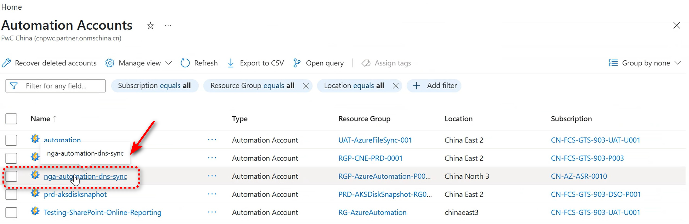
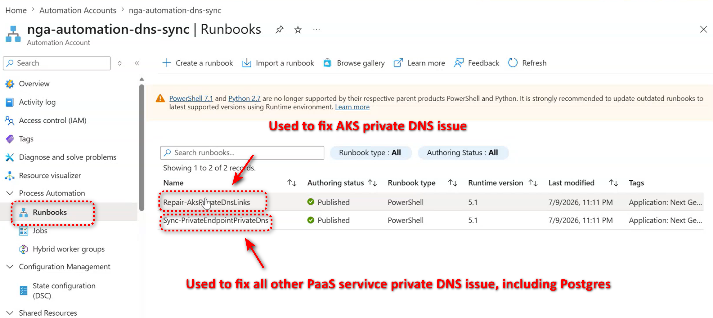
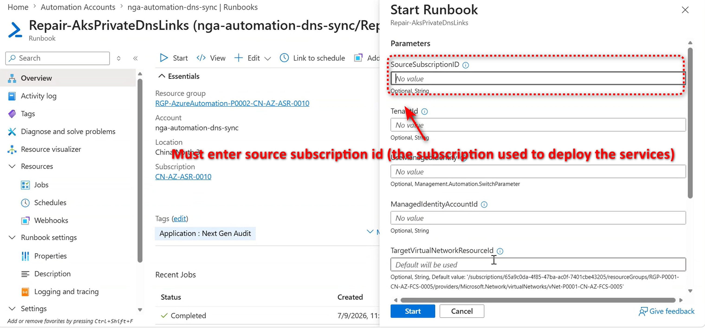

# PWC Azure China Private DNS Automation

Automates Private DNS operations for PWC on Azure China:

- `Sync-PrivateEndpointPrivateDns` syncs supported Private Endpoint DNS zones from a source subscription to the default destination subscription.
- `Repair-AksPrivateDnsLinks` links AKS private DNS zones to the default FCS VNet.

Both runbooks are deployed by `Deploy-SyncPrivateEndpointPrivateDnsAutomation.ps1`.

## Defaults

| Setting | Default |
| --- | --- |
| Destination subscription | `65a9c0da-4f85-47ba-ac0f-7401cbe43205` |
| AKS target VNet | `/subscriptions/65a9c0da-4f85-47ba-ac0f-7401cbe43205/resourceGroups/RGP-P0001-CN-AZ-FCS-0005/providers/Microsoft.Network/virtualNetworks/vNet-P0001-CN-AZ-FCS-0005` |
| AKS private DNS suffix | `.cx.prod.service.azk8s.cn` |

Override these only when needed.

## 1. Install local modules

```powershell
Install-Module Az.Accounts -Scope CurrentUser
Install-Module Az.Resources -Scope CurrentUser
Install-Module Az.Automation -Scope CurrentUser
```

If `Az.Automation` requires a newer `Az.Accounts`, update the modules and start a new PowerShell session.

## 2. Deploy both Automation runbooks

```powershell
.\Deploy-SyncPrivateEndpointPrivateDnsAutomation.ps1 `
    -SubscriptionId "<automation-account-subscription-id>" `
    -ResourceGroupName "rg-dns-sync-automation" `
    -AutomationAccountName "aa-dns-sync-cn-prod" `
    -Location "chinaeast2" `
    -SourceSubscriptionId "<default-source-subscription-id>" `
    -UserAssignedManagedIdentityResourceId "/subscriptions/<identity-subscription-id>/resourceGroups/<identity-resource-group>/providers/Microsoft.ManagedIdentity/userAssignedIdentities/<identity-name>"
```

This publishes:

- `Sync-PrivateEndpointPrivateDns`
- `Repair-AksPrivateDnsLinks`

The deploy script also saves Automation variables for the default source subscription, destination subscription, managed identity client ID, and AKS target VNet.

### Optional deployment overrides

```powershell
-DestinationSubscriptionId "<destination-subscription-id>"
-AksTargetVirtualNetworkResourceId "/subscriptions/<subscription-id>/resourceGroups/<resource-group>/providers/Microsoft.Network/virtualNetworks/<vnet-name>"
```

## 3. Optional: assign recommended RBAC

Run this only if the managed identity does not already have the required permissions.

```powershell
.\Deploy-SyncPrivateEndpointPrivateDnsAutomation.ps1 `
    -SubscriptionId "<automation-account-subscription-id>" `
    -ResourceGroupName "rg-dns-sync-automation" `
    -AutomationAccountName "aa-dns-sync-cn-prod" `
    -Location "chinaeast2" `
    -SourceSubscriptionId "<default-source-subscription-id>" `
    -UserAssignedManagedIdentityResourceId "/subscriptions/<identity-subscription-id>/resourceGroups/<identity-resource-group>/providers/Microsoft.ManagedIdentity/userAssignedIdentities/<identity-name>" `
    -AssignRecommendedRoles `
    -GrantSourceNetworkContributor `
    -GrantDestinationContributor
```

Recommended roles:

- Source subscription: `Reader`; optional `Network Contributor` for private endpoint zone-group linking.
- Destination subscription: `Private DNS Zone Contributor`; optional `Contributor` if the runbook may create missing resource groups.

## 4. Run from Azure Portal

### Step 1: Open the Automation Account

In the Azure China portal, open **Automation Accounts** and select the Automation Account where the runbooks were deployed, for example `nga-automation-dns-sync`.



### Step 2: Select the runbook

Under **Process Automation**, select **Runbooks**, and then select the published runbook for the required operation:

| Runbook | Use it for |
| --- | --- |
| `Repair-AksPrivateDnsLinks` | Repairing AKS private DNS virtual network links. |
| `Sync-PrivateEndpointPrivateDns` | Handling other supported Azure China PaaS private endpoint DNS zones, including PostgreSQL. |



### Step 3: Enter the source subscription and start

Select **Start**, enter the source workload subscription ID in `SourceSubscriptionId`, and then select **Start** at the bottom of the parameters pane. This is the subscription containing the private endpoints, private DNS zones, or AKS resources that the runbook must process.



After the job starts, open the job details to review its **Output**, **Warning**, **Error**, and **Verbose** streams. The deployment script enables verbose logging for the published runbooks so that stage counts, operation summaries, and completion duration are retained. By default, `Sync-PrivateEndpointPrivateDns` writes only changed rows to **Output**; no-change audit rows such as `ZoneGroupNoChange` are kept in **Verbose** summaries and suppressed from **Output**. Use `IncludeNoChangeResults = True` only when you want the full audit output.

For multiple source subscriptions, start the relevant runbook once per source subscription.

## 5. Schedule the sync runbook

```powershell
New-AzAutomationSchedule `
    -ResourceGroupName "rg-dns-sync-automation" `
    -AutomationAccountName "aa-dns-sync-cn-prod" `
    -Name "daily-private-endpoint-dns-sync" `
    -StartTime (Get-Date).AddHours(1) `
    -DayInterval 1

Register-AzAutomationScheduledRunbook `
    -ResourceGroupName "rg-dns-sync-automation" `
    -AutomationAccountName "aa-dns-sync-cn-prod" `
    -RunbookName "Sync-PrivateEndpointPrivateDns" `
    -ScheduleName "daily-private-endpoint-dns-sync"
```

For multiple source subscriptions, register one scheduled run per source:

```powershell
Register-AzAutomationScheduledRunbook `
    -ResourceGroupName "rg-dns-sync-automation" `
    -AutomationAccountName "aa-dns-sync-cn-prod" `
    -RunbookName "Sync-PrivateEndpointPrivateDns" `
    -ScheduleName "daily-private-endpoint-dns-sync" `
    -Parameters @{ SourceSubscriptionId = "<source-subscription-id>" }
```

## What the sync runbook does

`Sync-PrivateEndpointPrivateDns` processes all supported Azure China private DNS zones.

For each source DNS A record:

1. If a matching source private endpoint exists, the runbook links that private endpoint to the destination private DNS zone.
2. If no matching private endpoint exists, the runbook directly syncs the destination A record.
3. For directly synced records, it writes a provenance TXT record.
4. If the source record or source zone later disappears, stale destination records/IPs previously managed by this script are removed.

Cleanup is safe by design: it only touches destination records with this script's provenance TXT marker and matching `SourceSubscriptionId`, source zone, and source record metadata. Unmanaged IPs are preserved.

If source and destination tenants differ, the runbook automatically uses direct DNS record sync because private endpoint zone-group linking requires a single tenant.

## What the AKS repair runbook does

`Repair-AksPrivateDnsLinks` scans AKS private DNS zones ending with `.cx.prod.service.azk8s.cn` in the source subscription and ensures each matching zone is linked to the target VNet.

Local preview:

```powershell
.\Repair-AksPrivateDnsLinks.ps1 -WhatIf
```

Override source subscription locally:

```powershell
.\Repair-AksPrivateDnsLinks.ps1 `
    -SourceSubscriptionId "<source-subscription-id>"
```

## Local sync preview

```powershell
.\Sync-PrivateEndpointPrivateDns.ps1 `
    -SourceSubscriptionId "<source-subscription-id>" `
    -WhatIf
```

## Redis private endpoint integration test

`Deploy-TestRedisPrivateEndpointSync.ps1` performs an isolated end-to-end test
for either Azure Cache for Redis or Azure Managed Redis in Azure China. The
source and destination subscriptions must be in the same Microsoft Entra
tenant.

The signed-in account needs permission to create and remove the test resources:

- Source subscription: resource group, virtual network, Azure Cache for Redis,
    Azure Managed Redis, private endpoint, and private DNS resources, depending
    on the selected service type.
- Destination subscription: resource group and private DNS resources.

Run the classic Azure Cache for Redis test (the default service type):

```powershell
.\Deploy-TestRedisPrivateEndpointSync.ps1 `
    -SourceSubscriptionId "<source-subscription-id>" `
    -DestinationSubscriptionId "<destination-subscription-id>"
```

Run the Azure Managed Redis preview test:

```powershell
.\Deploy-TestRedisPrivateEndpointSync.ps1 `
        -SourceSubscriptionId "<source-subscription-id>" `
        -DestinationSubscriptionId "<destination-subscription-id>" `
        -RedisServiceType Managed `
        -OutputPath ".\managed-redis-private-endpoint-sync-test.json"
```

Azure Managed Redis is a gated preview in Azure China. The tested subscription
required the `Microsoft.Cache` preview features `AMRMooncakeBuildout`,
`AmrAugust2025Preview`, and the subscription-specific `cnn2-*` feature to be in
the `Registered` state, followed by refreshing the `Microsoft.Cache` resource
provider registration. The script performs a preflight request against
`Microsoft.Cache/redisEnterprise` API version `2025-07-01` and stops before
creating a resource group if the preview is not available. Live ARM validation
showed `chinanorth3` as the only enabled region for this preview subscription,
so Managed mode uses `chinanorth3` by default and rejects other regions.

The service-specific resources are:

| Service type | SKU | Private endpoint group ID | Private DNS zone | Service port |
| --- | --- | --- | --- | --- |
| `Classic` | Basic C0 | `redisCache` | `privatelink.redis.cache.chinacloudapi.cn` | 6380 (TLS) |
| `Managed` | Balanced B0 | `redisEnterprise` | `privatelink.redis.chinacloudapi.cn` | 10000 |

Managed mode deploys a `Microsoft.Cache/redisEnterprise` cluster and its
required `databases/default` child before creating the private endpoint. Both
modes disable public network access and initially link the endpoint to the
service-specific private DNS zone in the source test resource group. The test
then runs the real sync script with source and destination resource-group
filters and verifies:

1. Redis and the private endpoint provision successfully.
2. The source Redis private DNS A record contains the private endpoint IP.
3. The sync script matches the Redis private endpoint.
4. The endpoint's `privateDnsZoneGroups/default` configuration references the
   destination Redis private DNS zone and no longer references the source zone.
5. Azure creates the destination A record with the same private IP.
6. No provenance TXT record is created because Azure manages the A record
   through the private endpoint zone group.

Redis provisioning can take several minutes. The script writes detailed results
to `redis-private-endpoint-sync-test.json` and removes both test resource groups
by default, including after a failed assertion. Add `-KeepResources` to retain
the resources for troubleshooting. The JSON report includes cleanup commands.

The optional `SourcePrivateDnsZoneResourceGroupName` parameter added to
`Sync-PrivateEndpointPrivateDns.ps1` keeps this test isolated from other Redis
private DNS zones and endpoints in the source subscription. Normal runbook
execution remains subscription-wide when the parameter is omitted.

## Troubleshooting

Both runbooks emit timestamped tracing logs for:

- subscription selection
- zone and record counts
- private endpoint matching
- stale cleanup checks
- deleted/pruned destination record names and IPs
- operation summaries
- duration
- unhandled error details

Import or verify `Az.Accounts` and `Az.Resources` in the Automation Account before running the runbooks.
